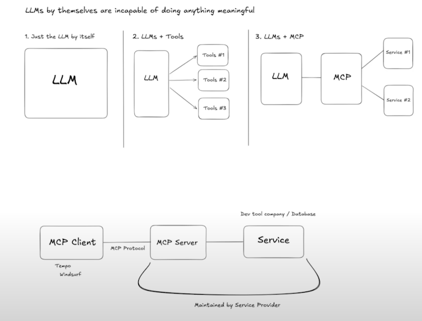

# Model Context Protocol (MCP)


## What is MCP?

The Model Context Protocol (MCP) is a standardized way to provide context and instructions to AI models, particularly large language models (LLMs). It's designed to make interactions with AI models more structured, reliable, and predictable.

## Key Features

- **Structured Communication**: MCP provides a clear format for how information should be organized when communicating with AI models
- **Context Management**: Helps maintain consistent context across interactions
- **Instruction Clarity**: Makes it easier to specify exactly what you want from the AI model
- **Protocol Standardization**: Creates a common language for AI model interactions

## Basic Structure

An MCP message typically includes:

1. **System Context**: High-level instructions and context for the AI
2. **User Query**: The specific question or task
3. **Response Format**: How you want the AI to structure its response
4. **Constraints**: Any limitations or requirements for the response

## Example

```json
{
  "system_context": "You are a helpful coding assistant",
  "user_query": "Help me debug this Python function",
  "response_format": {
    "analysis": "string",
    "solution": "string",
    "explanation": "string"
  },
  "constraints": {
    "language": "Python",
    "complexity": "intermediate"
  }
}
```

## Benefits

1. **Consistency**: Ensures AI responses follow a predictable pattern
2. **Clarity**: Reduces ambiguity in AI-human interactions
3. **Efficiency**: Makes it easier to process and use AI responses
4. **Scalability**: Works well for both simple and complex interactions

## Getting Started

To use MCP in your projects:

1. Define your system context
2. Structure your queries
3. Specify your desired response format
4. Add any necessary constraints
5. Send the formatted message to your AI model

## Contributing

Feel free to contribute to the development of MCP by:
- Suggesting improvements
- Adding new features
- Creating documentation
- Sharing use cases

## License

This project is open source and available under the MIT License. 